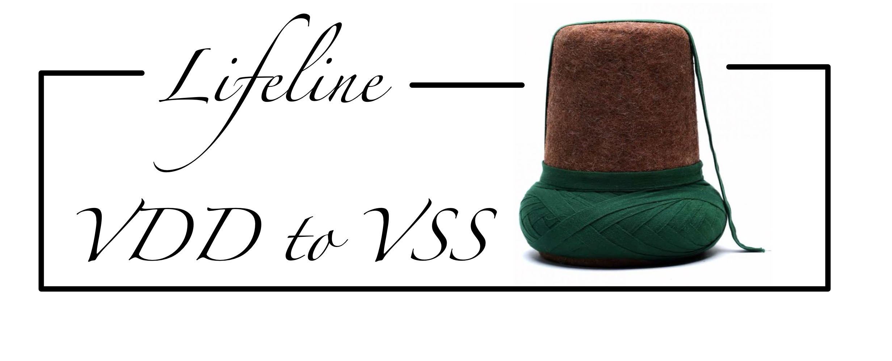

# Documentation
 

### Important tasks, 2023s – 2024s

- [X] writing and explaining the design flow
- [] take one early rail analysis
- [] take one static rail analysis data
- [] modifying some metrics and run static rail analysis 5 times
- [] Take output data
- [] Compare the output data according to input modification.
  

### Important QUESTIONS TO SUPERVISOR ?
- [ ] Cabtables is generated from foundry same as LEF file but QRC tech file is more accuarate which is generated from extractor tools?
- [ ] 
- [ ] 

These pages provide the documentation of IR drop analysis. You can use the links below to
navigate through the documentation.


## Table of Contents
1. [Chipyard Dependencies Installation](#Chipyard-Dependencies-Installation)
1. [Generator installation](#Generator-installation)
1. [Advanced PnR process](#Advanced-PnR-process)
1. [Advanced PnR process](#Advanced-PnR-process)
1. [Advanced PnR process](#Advanced-PnR-process)
1. [Conformal Verification](#Conformal-Verification)
1. [VERILOG](./verilog.md)
1. [Basic liberty file .lib](./timing_lib_file.md#go-back)
1. [conformat rtl and cpf script checking](./conformal_sanity_check.md#go-back)
1. [common_power_format script:sample](./common_power_file.md#go-back)
1. [Innovus_command](./importantinnovuscmd.md#go-back)
1. [Bitcells](./bitcells.md#go-back)
1. [Architecture](./architecture.md#go-back)
1. [Implementation](#implementation)
1. [Technology and Tool Portability](#technology-and-tool-portability)
1. [Tutorials](./tutorials.md#go-back)
1. [Debugging and Unit Testing](./debug.md#go-back)
1. [Technology Setup](./technology_setup.md#go-back)
1. [Library Cells](./library_cells.md#go-back)
1. [Base Data Structures](./base_data_structures.md#go-back)
1. [Hierarchical Design Modules](./design_modules.md#go-back)
1. [Control Logic and Timing](./control_logic.md#go-back)
1. [Routing](./routing.md#go-back)
1. [Characterization](./characterization.md#go-back)
1. [Results](./results.md#go-back)
1. [FAQ](./FAQ.md#go-back)
1. [Contributors/Collaborators](#contributorscollaborators)


## Chipyard Dependencies Installation
* this section is still developing


## Generator installation
```
git clone https://github.com/ucb-bar/chipyard.git
cd chipyard
git checkout 1.8.1 #Going back to previous 1.8.1 version
./build-setup.sh esp-tools  # Building the tool set

source env.sh

cd generators/gemmini
git config remote.origin.fetch "+refs/heads/*:refs/remotes/origin/*"
git fetch && git checkout v0.7.0
git submodule update --init --recursive

SPIKE_HASH=$(cat SPIKE.hash)

cd -
cd toolchains/esp-tools/riscv-isa-sim/build
git fetch && git checkout $SPIKE_HASH
make && make install

# The final step is only necessary if you want to run MIDAS simulations with
# realistic DRAM models
cd -
cd sims/firesim
source sourceme-f1-manager.sh --skip-ssh-setup # Ignore error messages from this command
./build-setup.sh --library --skip-validate
```


## Advanced PnR process
* CPF is important for power intent design and this will automatically take care of the P/G pins connections and previously it was describe manually
  in the time of place and routing flow.
* a proper CPF file will ensure the proper automatic insertion of retention flip-flop, level shifters, isolation cells also always on buffers.
* Here we are using PDK45( a total 2K std cells) with 6 metal (***where in this PDK,11 metal layers are avaiable***) layers(4 metal for std cell routing and 2 metal for P/G routing).
* Design details
     * Block name: sparc_exu_alu consists of (adder + logic operation)
     * This block have a total 341 inputs and 192 outputs
     * Clock speed is 330MHz
* The goal is to run low power physical implementation on the design.

* POWER DOMAIN: Each part of the design with different voltage corresponds to a power domain.
* Design: TOP =sparc_exu_alu² which is contains three power domain: **TOP; KERNEL_LO; and KERNEL_PSO**;
* TOP: **Always on domain**, KERNEL_PSO:**Power shutdown domain**, KERNEL_LO: **able to operate the same volt or lower voltage level**
* So all these different power domain must be define in CPF file as **Power_mode** definition.
     * So far here we have 3 power mode as we have three power domain
       1.**Fast** = top:1.2v, Kernel_pso:1.2v, kernel_Lo:1.2v
       2.**Eco** = top:1.2v, Kernel_pso:1.2v, kernel_Lo:1.0v
       3.**Sleep** = top:1.2v, Kernel_pso:0 v(shutoff), kernel_Lo:1.0v

⛺
* **Power shut off** is the most recent developed, an effective tecnique to reduced leakge current. It is using **power gating**, **sleep transistors**, to shut off the domain. Sleep transistor could be PMOS or NMOS.
* PMOS sleep transistor used to switch ==VDD suppy==, hence name is **header cell switch**
* NMOS sleep transistor used to control ==VSS supply==, hence name is **footer cell switch**
* Optimal sleep transistors designs and implementations are challenging due various effects as like design performence,area, routability,performance,power, signal/power integrity.
* Since this is multi voltage design we choose VDD, VDD1
* **important** Since we are using different power domains means we have different voltage domains, so clock frequency also modified according to multi domain area.
* Since here we have 3 power mode so we will get 3 different timing constraint sets ***(SDC)***
    * fast_mode(sparce_exu_alu_fastmode.sdc)
    * eco_mode(sparce_exu_alu_ecomode.sdc)
    * sleep_mode(sparce_exu_alu_sleepmode)
* These 3 modes of operations combined with 2 library corners 1. ***worst case*** 2. ***Best case*** and with 2 check type: 1. ***Setup*** 2. ***Hold***
* As we have different power supplies so we need level shifters.
    * so far, in KERNEL_LO domain needs to go Low to High (LVLLH ***level shifter cell***)
    * and sometimes we need to go to High to Low (LVLHL ***level shifter cell***)
    * To turn on KERNEL_PSO we need to insert ***Isolation cell*** by using naddsub_on signal.
    * For the switchable power domain we need ***Retention sequential element*** and ***Always ON*** cells
    * Retention logic needs two pins VDD and ExtVDD. VDD can be **UP** /**DOWN**.
    * AO buffer is needed for alway on powered.
    * ***IMPORTANT*** Another way to saving power is adding clock gating function. **2** ways we can change general RTL
      code into gated clock RTL 1. Changing RTL code with ANDED gate with clock 2. In the time of synthesis, we can set
       `set_attribute lp_insert_clock_gating true /` this type of clock gated cell can easily changed into **integrated Gating cell**
  ***TECHNOLOGY***
* **Libraries** Following std cells libraries is required:
* gsclib045_hvt:High voltage threshold:slow, low leakage
* svt: standard voltage threshold
* lvt: low voltage threshold
* ***Important*** in order to limit the routing layer we can use this code snippet `M1: Width 0.06µm / Thickness 1500Å` and `M2-M6: Width 0.08 µm /Thickness 1800Å`
* ***important*** to use linux command type `sh` to use innovus command `innovus`  or `exit`
# LAB: Understanding CPF (Common Power Format) file.
* Goal is, where do we want to place Isolation cell, level shifter cell, retention ff, swith logic and so on. In CPF file we have to describe them. ***CPF*** file format was developed by
  **Cadence design system**  but therer is another power format, name is UPF (***United Power Format***) develop by Synopsys and it becomes an IEEE standard
  format.
* Now We are going to study on ***CPF*** which is ASCII file meand its a human readable file and tcl based script.
* **CPF**: It is common practice to check the CPF file before use is in PnR. We are going to use cadence conformal Low Power Verification tool to check cpf file.
* 

* What's MCMM
MCMM stands for: Multi-Corner Multi-Mode (static timing analysis used in the design of digital ICs)

* What's a Mode

A mode is defined by a set of clocks, supply voltages, timing constraints, and libraries. It can also have annotation data, such as SDF or parasitics files.
Many chip have multiple modes such as functional modes, test mode, sleep mode, and etc.

* What's a Corner
A corner is defined as a set of libraries characterized for process, voltage, and temperature variations.
Corners are not dependent on functional settings; they are meant to capture variations in the manufacturing process, along with expected variations in the voltage and temperature of the environment in which the chip will operate.

Example:
Multi-mode multi-corner (MMMC) analysis refers to performing STA across multiple operating modes, PVT corners and parasitic interconnect corners at the same time. For example, consider a DUA that has four operating modes (Normal, Sleep, Scan shift, Jtag), and is being analyzed at three PVT corners (WCS, BCF, WCL) and three parasitic interconnect corners (Typical, Min C, Min RC)


There are a total of thirty six possible scenarios at which all timing checks, such as setup, hold, slew, and clock gating checks can be performed. Running STA for all thirty six scenarios at the same time can be prohibitive in terms of runtime depending upon the size of the design. It is possible that a scenario may not be necessary as it may be included within another scenario, or a scenario may not be required. For example, the designer may determine
that scenarios 4, 6, 7 and 9 are not relevant and thus are not required. Also, it may not be necessary to run all modes in one corner, such as Scan shift or Jtag modes may not be needed in scenario 5. STA could be run on a single scenario or on multiple scenarios concurrently if multi-mode multicorner capability is available.

```
[s_ids118@item0110 ~]$ cat .cshrc
# license
setenv LM_LICENSE_FILE "28211@item0096"
#Innovus
source /eda/cadence/2022-23/scripts/INNOVUSEXPORT_21.35.000_RHELx86.csh
#genus
source /eda/cadence/2022-23/scripts/GENUS_21.14.000_RHELx86.csh
#quantus
source /eda/cadence/2022-23/scripts/QUANTUS_21.11.000_RHELx86.csh
#tempus
source /eda/cadence/2022-23/scripts/SSV_22.11.000_RHELx86.csh
#conformal
source /eda/cadence/2022-23/scripts/CONFRML_22.10.200_RHELx86.csh 
#xrun
source /eda/cadence/2022-23/scripts/XCELIUM_22.03.005_RHELx86.csh
```
## Conformal:Verification
* Before starting any implementation, It´s always good practice to check the quality of the inputs for low power flow, especially the CPF file.
* **Conformal LowPower Verification tool**
  ***Library Power information Checking***
  ***Power Intent Creation***
  ***Power Intent Quality Cehcking***
  ***Design Power structure verification***
    - Need sanity check of CPF file
    - read both RTL netlist🍀 and CPF🍎 file
* RTL and CPF sanity checking in conformal scripts [conformat rtl and cpf script checking](./conformal_sanity_check.md#go-back)


* **Power Intent**✳️ power intent describes the partitioning of a design into power domains. In some cases those are active power domains that are being turned on and turned off. In some cases they are simply voltage domains, which is different supply voltages used in the same chip.”

Power intent also sometimes describes the control signals that are used to control these power domains. It describes special cells that are required to implement such a design such as level shifters, retention cells and so on, various rules that the architecture of the chip and the usage of these cells should contain—things like ‘this domain is always on,’ or ‘this domain is off under certain conditions,’ or ‘this particular cell is used between these domains


## Implementation  [common_power_format script:sample](./common_power_file.md#go-back)
* cpf file (low power)🪚:sample

## cabtable and QRC tech file
* Cab table is less accurate table for capacitances values and it is the basic and extended cap tables for all capacitances such as
  Coupling, fringe and area capacitances. Fringe capacitance is formed betw non overlapping sidewall of one conductor and surface/sidewall
  of a second conductor on the same or different layer from the first one.
* QRC tech is a binary file which will have more accurate characterization of the library elements.

## Command finding technique
* Sometimes in the middle of an EDI session, you want to run a command but you can't remember the exact name, or the exact options. Sometimes you don't even know if a command exists to do what you want, but you'd like to find out if it does. Obviously, you can always look at the EDI System Text Command Reference. (And I recommend doing so to learn all about the various EDI commands. This is a manual that I use every single day!) But sometimes you just want a quick reference at your fingertips. This is available in the form of command-line help.

Let's say you want to report the transition violations in your design. You know there's a command to do that, but you don't recall if it's report_tran_violation, reportTranViolation, or something else similar. At the EDI command prompt, you can type:

encounter 31> help report_t*
Multiple commands found:
      report_timing
      report_timing_derate
      report_timing_format

encounter 32> help reportT*
Multiple commands found:
      reportTimingDerate
      reportTimingLib
      reportTranViolation

Ah, there it is! But what are the options for this command? Now that we know the exact command name, we can do this:

encounter 33> help reportTranViolation
Usage: reportTranViolation
    reportTranViolation
    [-all | -noGlobalNets]
    [-selNetFile <selNetFileName>]
    [-excNetFile <excNetFileName>]
    [-useDrcMargin]
    -outfile
    <fileName>


* what is shell
* How many types of shell we have?
* what are the examples of command line interface shell
* what are the examples of graphical line interface shell
* what is system environment?
* what is variable environment?
* what is PATH?
* what is miniforge?
* what are the python distributions?
* 


## Contributors/Collaborators


* Companies are playing with engineer.
* esilicon acquired by inphi corporation
* inphi corporation acquired by Marcell Technology
   
  
(./img/pyroadmap.jpg)


Please, keep distance from my personal project/study area. :)
